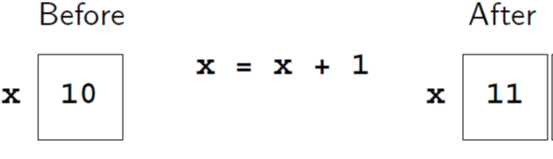
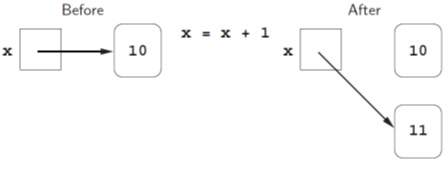

---
jupytext:
  formats: md:myst
  text_representation:
    extension: .md
    format_name: myst
kernelspec:
  display_name: Python 3
  language: python
  name: python3
---
 
# Memory management in Python

The memory model for comprehending how variables are stored in Python differs from that of other programming languages. In many programming languages, variables can be likened to named storage locations in computer memory—essentially boxes where we can place values. When a variable changes, the previous value is overwritten by a new one.



"In Python, values can be stored anywhere in memory, and variables are employed to reference them. Assigning a variable is analogous to placing a small yellow sticky note on the value and declaring, 'this is x.' This memory model is commonly referred to as the sticky-note model.



What happens when we execute the following statement?

```text
<<variable>> = <<expression>>
```

This is executed as follows:

1. Evaluate the expression on the right of the `=` sign to produce a value. This value has a memory address. We can call this an object: a value at a memory address with a type.
2. Store the memory address of the value in the variable on the left of the `=`. Create a new variable if that name does not already exist; otherwise, just reuse the existing variable, replacing the memory address that it contains.

```{code-cell} ipython3
difference = 20
double = 2 * difference
print(double)
difference = 5
print(double)
```

```{code-cell} ipython3
number = 3
print(number)
number = 2 * number
print(number)
number = number * number
```

You can use [Python Tutor](https://pythontutor.com/) to view how the sticky-notes change.
