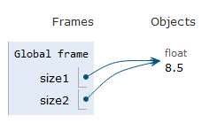

---
jupytext:
  formats: md:myst
  text_representation:
    extension: .md
    format_name: myst
kernelspec:
  display_name: Python 3
  language: python
  name: python3
---

# Built-in functions

## Absolute Value Function
`abs()` takes the absolute value of a number. 

`abs(-9)`: `-9` is the argument. Arguments appear between the parenthesis after the function name. Arguments are evaluated left to right.

```{code-cell} ipython3
day_temperature = 3
night_temperature = 10
abs(day_temperature - night_temperature)
```

Because function calls produce values, they can be used in expressions:

```{code-cell} ipython3
abs(-7) + abs(3.3)
```

## Functions to Convert Data Type
These functions convert the data type from one type to another if possible. This is called type casting. 

### int

Note, for floating point numbers, `int()` truncates towards zero.

```{code-cell} ipython3
int(34.6)
```

```{code-cell} ipython3
int('34')
```

This will fail!
```{code-cell} ipython3
int('34.6')
```

```{code-cell} ipython3
int(-4.3)
```

### float

```{code-cell} ipython3
float(21)
```

```{code-cell} ipython3
float('3.14')
```

```{code-cell} ipython3
float('300')
```

### str

```{code-cell} ipython3
str(21)
```


```{code-cell} ipython3
str(3.14)
```


### Rounding
The `round()` function can be used to round floats. The optional second input argument specifies the number of digits after the decimal place. 

```{code-cell} ipython3
round(3.8)
```

```{code-cell} ipython3
round(3.3)
```

```{code-cell} ipython3
round(3.5)
```

```{code-cell} ipython3
round(4.5)
```

```{warning}
Why do both `3.5` and `4.5` go to 4? Python uses IEEE 754 standard for rounding called the banker’s rounding. In this method when a number is between two numbers, the number is rounded to the nearest value with an even least significant digit. Still, the behavior of `round()` can be surprising. 
```

```{code-cell} ipython3
round(2.675, 2)
```

```{code-cell} ipython3
round(4.55, 1)
```

```{code-cell} ipython3
round(4.65, 1)
```

```{code-cell} ipython3
round(3.55, 1)
```

```{code-cell} ipython3
round(3.65, 1)
```

```{code-cell} ipython3
round(-3.3)
```

```{code-cell} ipython3
round(-3.5)
```

The round function can take an OPTIONAL second argument

```{code-cell} ipython3
round(3.141592653,2)
```

You can also ceil and floor values by first importing the `math` module and using ceil and floor
```{code-cell} ipython3
import math
print('round:', round(3.141592653))
print('ceil:', math.ceil(3.141592653))
print('floor:', math.floor(3.141592653))
```


### help

The `help(fxn)` function gives information about a function

```{code-cell} ipython3
help(round)

```

```{code-cell} ipython3
help(pow)
```

### pow

Using the `pow` function

```{code-cell} ipython3
pow(2, 4)
```

```{code-cell} ipython3
pow(2, 4, 3) 
```


### min 

```{code-cell} ipython3
min(2, 3, 4)
```

### max

```{code-cell} ipython3
max(2, -3, 4, 7, -5)
```

```{code-cell} ipython3
max(2, -3, min(4, 7), -5)
```

### id 

```{code-cell} ipython3
id(-9)
```

```{code-cell} ipython3
id(23.1)
```

```{code-cell} ipython3
print(id(8.5))

size1 = 8.5

print(size1)

print(id(size1))

size2 = 8.5

print(size2)

print(id(size2))
```




## Function Memory Address

Function objects have memory addresses just like variables. 

```{code-cell} ipython3
id(abs)
```

```{code-cell} ipython3
id(round)
```


## Using Function Calls as Arguments to Other Functions

```{code-cell} ipython3
pow(abs(-2), round(4.3))
```


There are many other built-in functions. The Python documentation describes all of [here](https://docs.python.org/3/library/functions.html#built-in-functions)