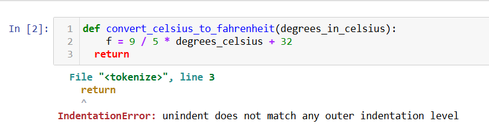

---
jupytext:
  formats: md:myst
  text_representation:
    extension: .md
    format_name: myst
kernelspec:
  display_name: Python 3
  language: python
  name: python3
---

# Video Recording


# Introduction to Functions

A Functions is a small, self-contained sequence of statements/instructions that has a name. Example: a function to convert Celsius to Fahrenheit. Since the formula for converting from Celsius to Fahrenheit is always the same and the only variable is the temperature in Celsius, you can write a function that takes the temperature as an argument, perform the conversion, and then return the temperature in Fahrenheit. 

What are the advantages of using functions?
  - Many programs require a particular sequence of statements/instructions to be executed repeatedly. The repeated statements/instructions can be placed with a single function, which can be accessed whenever needed. Therefore, they reduce repeated statements/instructions. 
  - Functions help decompose larger programs into logical subprograms. Such programs are easier to write and debug. 
  - Functions can be executed at any point by using their name 
  - Functions can call other functions
  - Functions can OPTIONALLY take argument(s) that they can use inside the function
  - Functions can OPTIONALLY return value(s)

The general form of a function call is as follows:
```
def <<function_name>>(<<parameters>>):
    body
```

```{note}
Note the difference between parameters and arguments: Function parameters are the names listed in the function's definition. Function arguments are the real values passed to the function. Parameters are initialized to the values of the arguments supplied.  [Reference](https://developer.mozilla.org/en-US/docs/Glossary/Parameter)
```

In many programming languages, braces ({}) are used to enclose the contents of a function. In Python, however, a function body is distinguished from surrounding code by indenting all the function content by four spaces. 

```{code-cell} ipython3
def convert_celsius_to_fahrenheit(degrees_in_celsius):
    return 9 / 5 * degrees_celsius + 32
```

## IndentationError

An **IndentationError** is a type of **SyntaxError** that occurs when the indentation is incorrect.

```python
def convert_celsius_to_fahrenheit(degrees_in_celsius):
    f = 9 / 5 * degrees_in_celsius + 32
  return 
```



